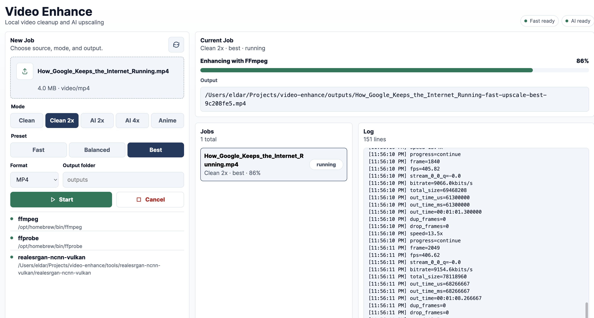
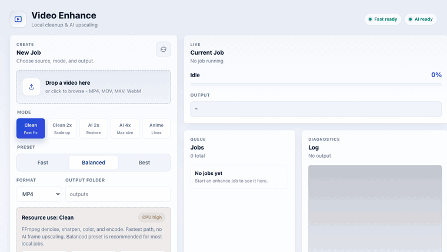

# Video Enhance

Local web UI for quick video cleanup and free AI upscaling.



The app is a Go server with embedded HTML/CSS/JS. It runs enhancement jobs through local command-line tools:

- `ffmpeg` for fast cleanup, denoise, sharpen, resize, audio preservation, and re-encoding.
- `realesrgan-ncnn-vulkan` for AI upscaling modes.

## Usage Demo



## Requirements

- macOS, Linux, or Windows capable of running Go and FFmpeg.
- Go `1.26.5` or newer. The module uses `go 1.26.5`, so recent Go installations with `GOTOOLCHAIN=auto` will use that toolchain automatically.
- FFmpeg and FFprobe for all enhancement modes.
- Real-ESRGAN ncnn Vulkan for AI modes.

## Quick Start

Install the local tools on macOS:

```bash
chmod +x scripts/install-tools-macos.sh
scripts/install-tools-macos.sh
```

Start the app:

```bash
go run . -open
```

If the browser does not open automatically, go to:

```text
http://127.0.0.1:8787
```

## How To Use

1. Select or drag a video into the upload area.
2. Choose an enhancement mode.
3. Choose a preset.
4. Keep `MP4` unless you need another container.
5. Leave the output folder as `outputs`, or enter a custom folder path.
6. Click `Start`.
7. Watch the current job progress and log.
8. Click `Download` when the job finishes.

Outputs are written locally. Nothing is uploaded to a remote service.

## Tool Setup

```bash
scripts/install-tools-macos.sh
```

This installs `ffmpeg` with Homebrew if needed and downloads the Real-ESRGAN ncnn Vulkan macOS package into `tools/`.

You can also provide custom tool paths:

```bash
export FFMPEG_BIN=/path/to/ffmpeg
export FFPROBE_BIN=/path/to/ffprobe
export REALESRGAN_BIN=/path/to/realesrgan-ncnn-vulkan
export REALESRGAN_MODEL_PATH=/path/to/models
```

## Modes

- `Clean`: fast denoise, sharpen, color lift, same size.
- `Clean 2x`: FFmpeg cleanup plus Lanczos 2x upscale.
- `AI 2x`: frame extraction, Real-ESRGAN 2x, rebuild video.
- `AI 4x`: frame extraction, Real-ESRGAN 4x, rebuild video.
- `Anime`: Real-ESRGAN anime model at 2x.

For YouTube Shorts, start with `AI 2x` and `Balanced`. Use `Clean 2x` when you want speed over AI quality. Use `AI 4x` only for shorter clips or when you can wait.

## Resource Use

Video enhancement is resource-heavy. The app runs local command-line tools, so CPU, GPU, disk, and battery use can be high while a job is active.

Exact usage depends on input resolution, duration, codec, and your machine. These are the practical expectations:

| Mode | CPU | GPU | Disk | Notes |
| --- | --- | --- | --- | --- |
| `Clean` | High | Low to medium | Low | FFmpeg filters and encoding may use most available CPU threads. On macOS, hardware video encoding may use the media engine. |
| `Clean 2x` | High | Low to medium | Low | Adds CPU scaling work. Usually the fastest acceptable option for quick Shorts cleanup. |
| `AI 2x` | Medium to high | High | High | Extracts every frame to PNG, upscales frames with Real-ESRGAN on one Vulkan GPU by default, then rebuilds the video. Temporary frames can use gigabytes. |
| `AI 4x` | Medium to high | Very high | Very high | Slowest and heaviest option. Best for short clips or low-resolution sources when you can wait. |
| `Anime` | Medium to high | High | High | Same AI pipeline as `AI 2x`, but with the anime model. Best for animation, cartoons, UI captures, and line art. |

Real-ESRGAN thread settings used by the app:

- `Fast`: `-j 2:2:2`
- `Balanced`: `-j 1:2:2`
- `Best`: `-j 1:2:2`

The `-j` values are `load:process:save`. Real-ESRGAN still uses one Vulkan GPU by default unless you customize the binary arguments in code.

## Presets

- `Fast`: lower quality settings, faster processing.
- `Balanced`: default quality/speed tradeoff.
- `Best`: stronger FFmpeg cleanup and higher-quality encoding. For videos, Real-ESRGAN TTA is disabled by default because it is extremely slow across thousands of frames.

To force Real-ESRGAN TTA for short clips or tests:

```bash
export REALESRGAN_TTA=1
```

## Output

By default, finished videos are written to `outputs/`. The web UI has an output folder field; relative paths are resolved from the project folder, and `~/` is expanded to your home folder.

Temporary job files are written to `jobs/` and removed after each job completes, fails, or is canceled.

## Build

```bash
go build -o dist/video-enhance .
```

Run the binary:

```bash
./dist/video-enhance -open
```

To use a different address or port:

```bash
./dist/video-enhance -addr 127.0.0.1:8787 -open
```
